<p align="center">
  
</p>

<h1 align="center">NestMover — AI-Powered Relocation Assistant</h1>

<p align="center">
  <em>Move smarter. Settle faster. Feel at home from day one.</em>
</p>

<p align="center">
  <a href="#-key-features">Features</a> •
  <a href="#-how-gemini-powers-nestmover">Gemini 3</a> •
  <a href="#%EF%B8%8F-architecture">Architecture</a> •
  <a href="#-getting-started">Setup</a> •
  <a href="#-demo--screenshots">Demo</a>
</p>

---

## 🚀 The Problem

**Moving to a new city is one of life's most stressful experiences.** You don't know where the best grocery stores are, which gym fits your routine, what restaurants match your taste, or whether a neighborhood truly aligns with your lifestyle. Most people spend *weeks* of trial-and-error before they feel settled — searching through generic review sites that know nothing about *them*.

There is no existing tool that takes your *personal history and preferences* and proactively recommends places tailored to your unique lifestyle in a new city.

## 💡 The Solution

**NestMover** is an AI-powered relocation assistant that eliminates the guesswork of moving. It analyzes your **Google Maps search history** using **Gemini 3** to deeply understand your lifestyle — your preferred cuisines, activity patterns, commute habits, budget range, and environment preferences — then generates **hyper-personalized place recommendations** in your new city.

Instead of browsing hundreds of generic results, you get a curated feed of places that *feel like you*, complete with confidence scores, personalized explanations, distance calculations, and Google Maps links.

---

## ✨ Key Features

| Feature | Description |
|---|---|
| **🧠 AI Lifestyle Profiling** | Upload your Google Maps search history and Gemini 3 builds a rich lifestyle profile — identifying your transportation habits, spending patterns, preferred environments, and social priorities |
| **🗺️ Personalized Exploration Engine** | Get AI-curated place recommendations across all your interest categories (restaurants, gyms, parks, entertainment, shopping, etc.) with confidence scores and tailored reasoning |
| **🚗 Smart Transportation Modeling** | Set your preferred commute methods (walking, biking, driving, transit) with custom radius limits, and NestMover filters recommendations within your comfort zone |
| **📍 Real-Time Place Intelligence** | Every recommendation is enriched with Google Maps links, place photos, distance from home, and travel duration via the Distance Matrix API |
| **🏠 My Nest — Saved Places** | Save your favorite discoveries to "My Nest" — your personal collection of go-to spots in your new city |
| **🔐 Google OAuth Authentication** | Secure sign-in with Google, with People API integration to auto-populate demographic data for better personalization |
| **📂 Google Drive Integration** | Import your Google Maps Takeout data directly from Google Drive — no manual file downloads needed |
| **⚡ Transparent AI** | Every recommendation includes a "Generated with Gemini" badge with a tooltip showing the exact prompt used — full explainability |

---

## 🤖 How Gemini Powers NestMover

NestMover leverages **Gemini 3** (`gemini-2.0-flash`) as its core intelligence engine across two critical pipelines:

### Pipeline 1: Behavioral Profile Generation
When a user uploads their Google Maps search history (exported via Google Takeout), Gemini 3 acts as a **data scientist** to:

1. **Parse & analyze** thousands of search entries from the JSON data
2. **Identify patterns** — frequent locations, preferred business types, time-of-day habits
3. **Infer lifestyle preferences** — cost sensitivity, environment preferences (e.g., "cozy", "trendy", "family-friendly"), and social priorities (e.g., accessibility, safety, pet-friendliness)
4. **Generate structured profiles** — outputting validated JSON with transportation modes, interest categories (with subcategories), environment descriptors, cost preferences, and confidence scores

The system instruction is carefully engineered to produce structured, parseable JSON with detailed fields like `userPreferences` (first-person narratives), `environmentDescriptors` (up to 6 adjectives), `relatedSubcategories`, and `costPreference`.

### Pipeline 2: Personalized Place Recommendations
When a user explores a category, Gemini 3 receives:
- The user's full profile (age, gender, address, transportation preferences, lifestyle narrative)
- Category-specific context (subcategories, environment descriptors, cost range)
- A directive to recommend real places with explanations

Gemini 3 returns structured recommendations with `place`, `address`, `personalizedSummary`, `recommendationReasoning`, and `confidence` scores — all rendered as interactive cards with live Google Maps data.

### Why Gemini 3?
- **Multimodal understanding**: Processes large, unstructured JSON data exports and extracts nuanced behavioral patterns
- **Structured output generation**: Reliably produces complex, nested JSON schemas for downstream processing
- **Contextual reasoning**: Generates human-readable explanations of *why* a specific place matches a specific user
- **Speed**: `gemini-2.0-flash` enables real-time recommendation generation with sub-second response times

---

## 🏗️ Architecture

```mermaid
graph TB
    subgraph Client["Frontend — React + TypeScript"]
        LP[Landing Page]
        AUTH[Google OAuth Sign-In]
        OB[Onboarding Flow — 5 Steps]
        EXP[Explore Page — AI Recommendations]
        NEST[My Nest — Saved Places]
        PROF[User Profile]
    end

    subgraph Server["Backend — Flask + Python"]
        GP[/generate-profile/]
        GC[/generate-content/]
        GPI[/get-google-place-info/]
        GDF[/get-google-drive-file/]
        FPI[/fetch-people-info/]
    end

    subgraph Google["Google Cloud APIs"]
        GEMINI["Gemini 3<br/>(gemini-2.0-flash)"]
        MAPS[Google Maps JS API]
        PLACES[Google Places API]
        DIST[Distance Matrix API]
        DRIVE[Google Drive API]
        PEOPLE[People API]
    end

    subgraph Data["Firebase"]
        FBAUTH[Firebase Auth]
        FBDB[Realtime Database]
    end

    LP --> AUTH
    AUTH --> FBAUTH
    AUTH --> OB
    OB -->|Upload Maps History| GP
    OB -->|Save Profile| FBDB
    EXP -->|Request Recs| GC
    EXP -->|Get Place Details| GPI
    NEST --> FBDB
    GP --> GEMINI
    GC --> GEMINI
    GPI --> PLACES
    GPI --> DIST
    GDF --> DRIVE
    FPI --> PEOPLE
    PROF --> FBDB

    style Client fill:#e8f5e9,stroke:#2e7d32
    style Server fill:#e3f2fd,stroke:#1565c0
    style Google fill:#fce4ec,stroke:#c62828
    style Data fill:#fff3e0,stroke:#e65100
```



### Tech Stack

| Layer | Technology | Purpose |
|-------|-----------|---------|
| **Frontend** | React 18, TypeScript, Material UI | Responsive SPA with component library |
| **Backend** | Flask, Python 3 | RESTful API server handling AI and map queries |
| **AI Engine** | Gemini 3 (gemini-2.0-flash) | Profile generation, place recommendations, lifestyle analysis |
| **Authentication** | Firebase Auth + Google OAuth | Secure user sign-in with Google accounts |
| **Database** | Firebase Realtime Database | User profiles, preferences, and saved places |
| **Maps & Places** | Google Maps JS, Places, Distance Matrix, Geocoding APIs | Location search, photos, distance/duration calculations |
| **Data Import** | Google Drive API, People API | Maps Takeout import, demographic auto-population |
| **Deployment** | Google Cloud Run, Firebase Hosting | Containerized backend (Docker), static frontend hosting |

---

## 📦 Project Structure

```
NestMover/
├── client/                         # React + TypeScript Frontend
│   ├── src/
│   │   ├── components/
│   │   │   ├── landing/            # Landing page sections (Welcome, Features, How It Works, etc.)
│   │   │   ├── onboarding/         # 5-step onboarding flow components
│   │   │   ├── ExploreCard.tsx     # AI recommendation card with Maps integration
│   │   │   ├── ExploreCategory.tsx # Category-based recommendation container
│   │   │   ├── GenerateWithGemini.tsx # "Generated with Gemini" transparency badge
│   │   │   ├── MapInfoCard.tsx     # Google Maps info overlay
│   │   │   └── MyNestCard.tsx      # Saved places card
│   │   ├── services/
│   │   │   ├── ExploreService.ts           # AI recommendation API calls & prompt engineering
│   │   │   ├── FullOnboardingProfileService.ts  # Multi-step Gemini profile generation
│   │   │   ├── OnboardingProfileService.ts      # Single-pass Gemini profile generation
│   │   │   └── UserProfileServices.ts           # Firebase user data operations
│   │   ├── models/                 # TypeScript interfaces (User, Category, Transportation, etc.)
│   │   ├── context/                # React auth context (Firebase)
│   │   ├── pages/                  # Route-level pages (Landing, Dashboard, Explore, My Nest, etc.)
│   │   └── constants/              # Tooltip content and search page constants
│   └── public/                     # Static assets
│
├── server/                         # Flask + Python Backend
│   ├── server.py                   # API router — 5 endpoints
│   ├── scripts/
│   │   ├── system_instructions.py          # Gemini content generation with retry logic
│   │   ├── file_input_system_instructions.py  # Gemini file-based profile generation
│   │   ├── google_place_info_extractor.py     # Places API + Distance Matrix integration
│   │   ├── google_drive_file_extractor.py     # Google Drive file download
│   │   └── people_info_api_request.py         # People API user info
│   ├── Dockerfile                  # Container config for Cloud Run
│   ├── app.yaml                    # App Engine / Cloud Run configuration
│   └── requirements.txt           # Python dependencies
│
└── README.md
```

---

## 🎬 Demo & Screenshots

### User Flow

```mermaid
graph LR
    A["🏠 Landing Page"] --> B["🔐 Google Sign-In"]
    B --> C["📊 Dashboard"]
    C --> D["🧠 Onboarding"]
    D --> D1["Step 1: Choose Method<br/>(Upload Maps History or Manual)"]
    D1 --> D2["Step 2: Transportation<br/>(Set home address, commute modes & radius)"]
    D2 --> D3["Step 3: Preferences<br/>(Social priorities & lifestyle descriptors)"]
    D3 --> D4["Step 4: Review<br/>(Verify AI-generated profile)"]
    D4 --> D5["Step 5: Categories<br/>(Fine-tune interest categories)"]
    D5 --> E["🗺️ Explore<br/>(AI-powered recommendations)"]
    E --> F["🏠 My Nest<br/>(Save favorites)"]

    style A fill:#e8f5e9
    style E fill:#fff3e0
    style F fill:#fce4ec
```



### Key Interactions
1. **Upload Google Maps History** → Gemini 3 analyzes your search patterns and auto-generates a complete lifestyle profile
2. **Edit & Refine** → Review the AI-generated profile, adjust transportation radius, toggle social priorities, and fine-tune categories
3. **Explore** → Browse AI-curated recommendations organized by category, each with a personalized summary and confidence score
4. **Save to My Nest** → Collect your favorite places into your personal relocation guide

---

## 🛠️ Getting Started

### Prerequisites

- **Node.js** (v16+) and **npm** for the client
- **Python 3.9+** and **pip** for the server
- A **Google Cloud Platform** project with the following APIs enabled:
  - Gemini API (Generative Language API)
  - Google Maps JavaScript API
  - Google Places API
  - Distance Matrix API
  - Google Drive API
  - People API
  - Identity Toolkit API
- A **Firebase** project with Authentication and Realtime Database enabled

### Installation

#### Client

```bash
cd client
npm install
npm run start
```

#### Server

```bash
cd server
pip install -r requirements.txt
python3 server.py
```

### Environment Configuration

Create `.env` files in both the `client/` and `server/` directories:

**Client `.env`**
```env
REACT_APP_apiKey=YOUR_FIREBASE_API_KEY
REACT_APP_authDomain=YOUR_AUTH_DOMAIN
REACT_APP_projectId=YOUR_PROJECT_ID
REACT_APP_storageBucket=YOUR_STORAGE_BUCKET
REACT_APP_messagingSenderId=YOUR_MESSAGING_SENDER_ID
REACT_APP_appId=YOUR_APP_ID
REACT_APP_measurementId=YOUR_MEASUREMENT_ID

REACT_APP_peopleAPIKey=YOUR_PEOPLE_API_KEY
REACT_APP_googleMapsAPIKey=YOUR_GOOGLE_MAPS_API_KEY
REACT_APP_geminiAIKey=YOUR_GEMINI_API_KEY
```

**Server `.env`**
```env
REACT_APP_geminiAIKey=YOUR_GEMINI_API_KEY
REACT_APP_googleMapsAPIKey=YOUR_GOOGLE_MAPS_API_KEY
REACT_APP_placesAPIKey=YOUR_PLACES_API_KEY
```

---

## 🌍 Real-World Impact

### Who This Helps
- **40+ million Americans move each year** — NestMover directly addresses the discovery problem every mover faces
- **College students** relocating for school who need to quickly find essentials in an unfamiliar city
- **Remote workers** exploring new cities to live in and wanting AI-powered local insights
- **International movers** with no local knowledge and a strong need for personalized guidance
- **Families** needing to find family-friendly restaurants, parks, and schools that match their specific priorities

### Why It Matters
Existing solutions (Google Maps, Yelp, Reddit) require users to *already know what they're looking for*. NestMover flips this model by proactively understanding the user through their behavioral history and intelligently surfacing relevant places — turning a weeks-long discovery process into minutes.

---

## 🧑‍💻 Author

**Sathvik Vempati**  
📧 [Vempati.honey@gmail.com](mailto:Vempati.honey@gmail.com)  
🔗 [GitHub — SVstudent](https://github.com/SVstudent)

---

## 📄 License

This project is licensed under the **MIT License** — see the [LICENSE](LICENSE) file for details.

---

## 🙏 Acknowledgments

- **Google** — for the Gemini API, Maps Platform, Firebase, and Cloud Run infrastructure that powers NestMover
- **Material UI** — for the component library enabling a polished user experience
- All open-source contributors whose libraries made this project possible
